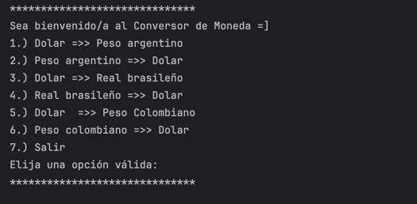

# Conversor de Moneda
 
Este es el proyecto Conversor de Moneda desarrollado en Java, como Challenger para poner en práctica los diferentes aprendizajes y habilidadaes desarrolladas en los módulos de Alura. 

El conversor de monedas se conecta a una API para obtener tasas de conversión de distintas monedas y realizar cálculos de conversión entre ellas.  

### Características

Conversión entre varias monedas utilizando tasas de cambio en tiempo real.
Menú interactivo para seleccionar opciones de conversión.
Manejo de errores para entradas no válidas.
Conexión a una API externa para obtener tasas de conversión actualizadas.

### Requisitos

- Java 8 o superior.

- Conexión a Internet para consultar las tasas de conversión.  

### Bibliotecas externas:

- Gson para la manipulación de datos JSON. 

- HttpClient para las solicitudes HTTP.  

### Instalación

1. Clona el repositorio:

    
    git clone https://github.com/FranGuzGon/Challenger2ConversorMonedas.git

2. Importa el proyecto en tu IDE de preferencia (IntelliJ, Eclipse, VSCode, etc.).

3. Añade las dependencias necesarias en tu archivo pom.xml o configuración de tu proyecto.

4. Compila y ejecuta el proyecto desde la clase Principal.  

### Uso

Al ejecutar el programa, se mostrará un menú con las siguientes opciones

### Conversión de Monedas

- Seleccione una opción introduciendo un número correspondiente del menú.
- Ingrese la cantidad que desea convertir.
- El programa calculará y mostrará el resultado de la conversión basado en las tasas actuales obtenidas de la API.  

### Manejo de errores

- Si se ingresa un valor no numérico al seleccionar una opción, el programa mostrará un mensaje de error e invitará al usuario a elegir nuevamente.

- De igual forma, si se ingresa un valor no numérico al introducir la cantidad a convertir, se mostrará un mensaje de error.  

### Clases y Funcionalidades

- Clase Moneda (Record): Almacena los datos base_code, exit_code, y conversion_rates.

- Clase ConsultaMoneda: Realiza la conexión a la API para obtener las tasas de conversión y devuelve un objeto Moneda.

- Clase Principal: Contiene el menú principal y la lógica de selección de opciones por parte del usuario.

- Clase ConversionMoneda: Realiza la conversión entre las monedas basadas en las tasas obtenidas.  

### API utilizada

Este proyecto se conecta a la API https://v6.exchangerate-api.com/ para obtener las tasas de conversión entre diferentes monedas.  

### Contribuciones

¡Las contribuciones son bienvenidas! Si deseas mejorar este proyecto, no dudes en hacer un fork y enviar un pull request.  

### Licencia

Este proyecto está bajo la licencia MIT. Consulta el archivo LICENSE para más detalles.  

